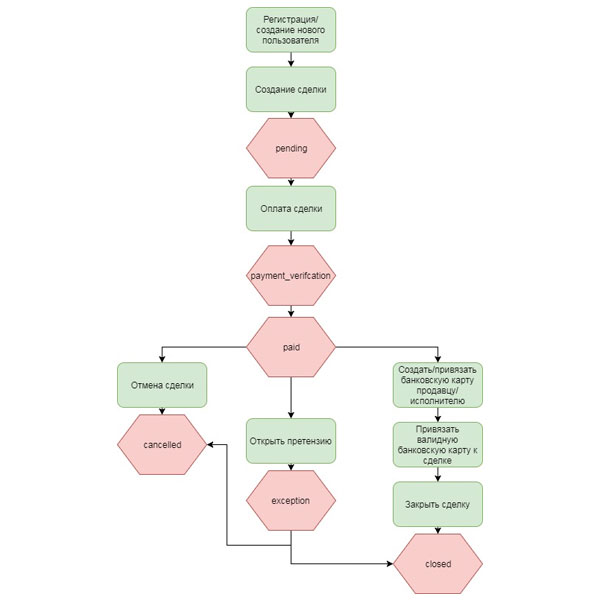

[](https://www.safecrow.ru/)
# Документация API SafeCrow V3
##### версия документа 3.02  
### Версии документа  

Версия | Дата | Предмет изменений
------------ | ------------- | -------------
3.01 | 22-02-2018 | Первый выпуск документа
3.02 | 19-03-2018 | Добавлена возможность прикреплять файлы к сделке и просматривать их

## Оглавление  
1. [Введение](#intro)  
2. [Бизнес–процесс](#step-deal) 
3. [Регистрация пользователя](#reg)  
4. [Посмотреть список пользователей](#user-list) 
5. [Посмотреть данные пользователя](#user-info)  
6. [Редактировать данные пользователя](#user-edit) 
7. [Создание сделки](#create) 
8. [Просмотр сделок](#show-deal)  
9. [Аннулирование сделки](#deleted)  
10. [Оплата сделки](#pay) 
11. [Привязать банковскую карточку к пользователю](#user-card)  
12. [Посмотреть привязанные к пользователю карты](#show-user-cards)  
13. [Привязать карту к сделке](#bind-card)  
14. [Отменить сделку](#canceled)  
15. [Закрыть сделку](#close)  
16. [Эскалировать сделку (открыть претензию](#exception)  
17. [Другие ошибки](#errors)  
18. [Добавить вложение (Attaches)](#add-attaches)   
19. [Просмотреть вложения](#show-attaches)  
20. [Настройки](#settings)  


## <a name="intro">Введение</a> 
В данном документе идет описание **API SafeCrow V3**, которое стало значительно проще в плане интеграции за счет изменения как бизнес-процесса, так и программного кода.
Основные изменения в новой версии:  

* Мы убрали процесс подтверждения сделки;  
* Мы убрали процесс доставки. Теперь, если вы хотите отслеживать тот факт, что Продавец отправил, а Покупатель получил товар, необходимо самостоятельно осуществить данный процесс у вас на сайте;  
* Добавили возможность отмены сделки. Важно! В документе есть несколько вариантов проведения отмены: `«full»` - полный возврат денежных средств, включая комиссию сервиса, `«with_commission»` - отмена с удержанием комиссии c покупателя, `«with_penalty»` - полный возврат денежных средств покупателю, комиссия удерживается с партнера. Доступные для вас варианты отмены обсуждаются отдельно с вашим менеджером.  

## <a name="step-deal">Бизнес–процесс</a>
Последовательность шагов для создания и проведения сделки изображена на **рис. 1.** 
 
**Важно!**
Данный процесс изменился  по сравнению с версий v1.  

 Рис.1  

### Авторизация

В API V3 авторизация сделана прозрачной, в основе нее `http basic auth` и `hmac подписи`.  

В качестве логина надо использовать `api-key`, в качестве пароля `hmac подпись` тела запроса секретным ключем.  


## <a name="reg">Регистрация (создание) пользователя</a>

Для создания/регистрации пользователя следует использовать запрос `POST /users` и указать следующие переменные:  

 | Переменные | Данные
------------ | -------------
**Обязательные** | | 
| accepts_conditions | `true` – пользователь принял соглашение safecrow
| phone | номер мобильного телефона
| name | Имя Фамилия
| email | e-mail пользователя

*Пример запроса*  

```json
POST /users
 
{
  "accepts_conditions": true,
  "phone": "79251234567",
  "name": "Иван Иванов"
}
```  

*Пример ответа*
```json
{
  "id": 467,
  "email": null,
  "phone": "79251234567",
  "name": "Вася Васильев",
  "registered_at": "2018-02-05T12:17:01+03:00"
}
```
Создан пользователь 467,  5 февраля 2018 в 12:17  

#### Сообщения об ошибках:  
*Пример*  
```json
"errors": {
    "accepts_conditions": [
      "Key must be present!"
    ]
 }
```
**`“Key must be present!”`** - поле не было передано

**`"Set terms to true"`** - примите условия, значение переменной `accepts_conditions` должно быть `true`  

## <a name="user-list">Посмотреть список пользователей</a>  

Для просмотра всех зарегистрированных пользователь достаточно ввести один запрос

*Пример запроса*
```json
GET /users
```

*Пример ответа*
```json
{
    "id": 467,
    "email": "test@email.com",
    "phone": null,
    "name": "Вася Васильев",
    "registered_at": "2018-02-05T12:17:01+03:00"
 
 }
```

## <a name="user-info">Посмотреть данные пользователя</a>  

Для просмотра данных пользователя, используйте запрос: `GET /users/:user_id`  

*Пример запроса*
```json
GET /users/467
```

*Пример ответа*
```json
{
  "id": 467,
  "email": "test@email.com",
  "phone": null,
  "name": "Вася Васильев",
  "registered_at": "2018-02-05T12:17:01+03:00"
}
```  
##### Комментарии:
*Как насчет написать ответ, если такого id нет? Код ошибки должен быть 404, в теле писать `“user not found”`*  

## <a name="user-edit">Редактировать данные пользователя</a>  
Редактировать и добавить данные пользователю можно используя запрос `POST /users/:user_id`. Можно изменить следующие переменные:  

Переменные | Данные
------------ | -------------
accepts_conditions | `true` – пользователь принял соглашение SafeCrow
email | e-mail пользователя
name | Имя Фамилия
phone | номер мобильного телефона

*Пример запроса*
```json
POST /users/467
{
  "phone": "79161540474",
  "name": "Иван Васильев"
}
```

*Пример ответа*
```json
{
  "id": 467,
  "email": "test@email.com",
  "phone": "79161540474",
  "name": "Иван Васильев",
  "registered_at": "2018-02-05T12:17:01+03:00"
}
```  

К пользователю 467 был добавлен телефон и изменено имя.


## <a name="create">Создание сделки</a>  
Для создания сделки следует использовать `POST /orders` и указать следующие переменные:

| Переменные | Данные
------------ | -------------
**Обязательные** | | 
| consumer_id | integer 
| supplier_id | integer 
| price | integer (в копейках, минимум 100 руб (10000)) 
| description | string 
| fee_payer | “50/50”, “consumer” или “supplier”
**Второстепенные** | |
| extra | ассоциативный массив - дополнительная информация  

*Пример запроса*
```json
POST /orders
{
  "consumer_id": 467,
  "supplier_id": 466,
  "price": 10000,
  "description":"something",
  "fee_payer":"50/50",
}
```

*Пример ответа*
```json
{
  "id": 29,
  "consumer_id": 467,
  "supplier_id": 466,
  "price": 10000,
  "fee": 400,
  "fee_payer": "50/50",
  "status": "pending",
  "description": "something",
  "supplier_payout_method_id": null,
  "consumer_payout_method_id": null,
  "supplier_payout_method_type": null,
  "consumer_payout_method_type": null,
  "created_at": "2018-02-07T18:32:17+03:00",
  "updated_at": "2018-02-07T18:32:17+03:00",
  "extra": {
  }
}
```   
Была создана сделка 29, стоимость сделки 100 рублей, комиссия составляет 4 рубля и  платится пользователями пополам. В этот момент статус сделки становится `“pending”`.
#### Сообщения об ошибках:  
**`"extra": "Некорректный тип данных"`** - должен передаваться ассоциативный массив `ключ-значение`

***Комментарии:***  
*нет проверки на минимальную / максимальную сумму*  

## <a name="show-deal">Просмотр сделок</a>

Посмотреть данные **всех сделок** - `GET /orders`

Посмотреть **сделку по id** - `GET /orders/:order_id`

Посмотреть данные сделок **конкретного пользователя по его id** - `GET /users/:user_id/orders`  

*Пример запроса*
```json
GET /users/467/orders
```

*Пример ответа*
```json
{
  "id": 29,
  "consumer_id": 467,
  "supplier_id": 466,
  "price": 10000,
  "fee": 400,
  "fee_payer": "50/50",
  "status": "pending",
  "description": "someting",
  "supplier_payout_method_id": null,
  "consumer_payout_method_id": null,
  "supplier_payout_method_type": null,
  "consumer_payout_method_type": null,
  "created_at": "2018-02-07T18:32:17+03:00",
  "updated_at": "2018-02-07T18:32:17+03:00",
  "extra": {
  }}
```   
В ответ на запрос придет список всех сделок, в которых участвовал пользователь.  
В данном примере к пользователю привязана одна сделка.  

## <a name="deleted">Аннулирование сделки</a>

Для аннулирования активной сделки до оплаты используется запрос `POST /orders/:order_id/annul` и данные:
  
Переменные | Данные
------------ | -------------
reason | string  

*Пример запроса*
```json
POST /orders/31/annul
 {
  "reason": "Some reason"
 }
```

*Пример ответа*
```json
{
  "id": 31,
  "consumer_id": 467,
  "supplier_id": 466,
  "price": 10000,
  "fee": 400,
  "fee_payer": "50/50",
  "status": "annulled",
  "description": "someting",
  "supplier_payout_method_id": null,
  "consumer_payout_method_id": null,
  "supplier_payout_method_type": null,
  "consumer_payout_method_type": null,
  "created_at": "2018-02-08T12:01:35+03:00",
  "updated_at": "2018-03-06T12:22:00+03:00",
  "extra": {
  }
}
```  
## <a name="pay">Оплата сделки</a>  

Для оплаты сделки в запросе указывается номер `(id)` сделки, которая будет оплачена Покупателем `(consumer)` - `POST /orders/:order_id/pay`.  
Также необходимым полем является переменная `redirect_url` - ссылка на страницу, куда будет направлен пользователь после оплаты.  

Переменные | Данные
------------ | -------------
redirect_url | cсылка (String)  

Далее пример запроса на оплату ранее созданной сделки  29 и получения в ответ ссылки на оплату.  

*Пример запроса*
```json
POST /orders/29/pay
  {
    "redirect_url": "http://example.com/return/url"
  }
```

*Пример ответа*
```json
{
  "payment_url":"https://staging.safecrow.ru/finances/29/pay?jsOperationId=3e1ba729e68445c4a37
    062c556385&return_to=",
  "consumer_pay": 102.0
}
```  
В ответе по ссылке осуществляется оплата, после чего происходит редирект на указанный в запросе url, к которому добавляются параметры:
  
Параметры | Данные
------------ | -------------
orderId | id сделки + _ + случайное число  (11_a43234)
status | success или fail
type | pay  

*Пример ссылки*
```
http://example.com/return/url?orderId=29_a44298&status=success&type=pay
```  
Cтатус сделки изменится на `paid`.

***Комментарии:***

*[https://staging.safecrow.ru/finances/32/pay?etc](https://staging.safecrow.ru/finances/32/pay?etc) -  по ссылке, на страницу оплаты никакая информация о сделке не передается, нет никаких сообщений об ошибке (дата, номер карты) нет сообщений, если ссылка уже недействительна.*  


## <a name="user-card">Привязать банковскую карточку к пользователю</a>  

Для привязки карты используйте запрос - `POST /users/:user_id/bind_card`


Переменные | Данные
------------ | -------------
redirect_url | ссылка (String)

*Пример запроса*  
```json
 POST /users/467/bind_card
  {
    "redirect_url": "http://example.com/return/url"
  }
```

*Пример ответа*  
```json
{
  "card_binding_url": "https://safecrow.ru/finances/card_binding/467?jsOperationId             
  =binding_5ae972a2-e5bb-4913-83a1-ac7408e30f54&return_to="
}
```

В ответ приходит ссылка на заполнение данных банковской карты.

**Сообщения об ошибках:**  
**`"phone": [ "Can not be empty!" ]`** - к пользователю должен быть привязан телефонный номер ([привязать](#user-edit), изменив данные пользователя)

***Комментарии:***

*[https://staging.safecrow.ru/finances/card_binding/468](https://staging.safecrow.ru/finances/card_binding/468) вкладка называется `“Оплата Mandarin”` - но это привязка карты + нет никакой проверки на основные поля (сообщений об ошибках), нет валидации на карту/ошибки на неправильный телефон.*  

## <a name="show-user-cards">Посмотреть привязанные к пользователю карты</a>

После заполнения данных карты, она привязывается к пользователю, список всех привязанных  карт, включая неудачные попытки можно узнать, используя `GET /users/:user_id/cards?all=true`  

Для просмотра всех банковских карт, подтвержденных мандарином `GET /users/:user_id/cards`  

*Пример запроса*
```json
GET /users/467/cards
``` 

*Пример ответа*
```json
{
  "id": 179,
  "card_binding": "5ae972a2-e5bb-4913-83a1-ac7408e30f54",
  "card_holder": "CARD HOLDER",
  "card_number": "492950XXXXXX6878",
  "card_expiration_year": 2020,
  "card_expiration_month": 10,
  "status": "success",
  "created_at": "2018-02-06T16:46:21+03:00",
  "updated_at": "2018-02-06T16:46:22+03:00",
  "user_id": 467
}
```  
Если карта не была привязана - в ответ придет пустой список.  

## <a name="bind-card">Привязать карту к сделке</a>  

Для выплаты продавцу `(supplier)` будет использована одна из ранее привязанных к нему карт, к запросу `POST /users/:user_id/orders/:order_id/bind_card` требуется добавить `переменную id` карты – [узнать id](#show-user-cards). 

*Пример запроса*
```json  
POST /users/466/orders/29/bind_card  
  {
    "card_id": 467
  }
``` 

*Пример ответа*
```json
"id": 29,
  "consumer_id": 467,
  "supplier_id": 466,
  "price": 10000,
  "fee": 400,
  "fee_payer": "50/50",
  "status": "paid",
  "description": "something",
  "supplier_payout_method_id": 180,
  "consumer_payout_method_id": null,
  "supplier_payout_method_type": "CreditCard",
  "consumer_payout_method_type": null,
  "created_at": "2018-02-13T10:56:40+03:00",
  "updated_at": "2018-02-13T14:35:25+03:00",
  "extra": {
  }
```  
Ответ - описание сделки, в полях `supplier_payout_method_id` и `type` указана информация соответственно об `id карты` и `типе выплаты`.


***Комментарии:***  
*Зачем нужен тип оплаты, если у нас только карты?  
-Будет больше.*  

## <a name="canceled">Отменить сделку</a> 
После оплаты `(статус paid)` сделку можно отменить, используя следующий запрос: 
`POST /orders/:order_id/cancel`

Переменные | Данные
------------ | -------------
reason | String
method | full, with_commission, with_penalty

*Пример запроса*
```json  
POST /orders/51/cancel
{
 "reason": "Some important reason",
 "method": "full"
}
``` 

*Пример ответа*
```json
{
  "id": 51,
  "consumer_id": 467,
  "supplier_id": 466,
  "price": 10000,
  "fee": 400,
  "fee_payer": "consumer",
  "status": "cancelled",
  "description": "something",
  "supplier_payout_method_id": 180,
  "consumer_payout_method_id": null,
  "supplier_payout_method_type": "CreditCard",
  "consumer_payout_method_type": null,
  "created_at": "2018-02-21T11:18:40+03:00",
  "updated_at": "2018-02-22T14:43:15+03:00",
  "extra": {
  }
}
```  

Сделка переходит в статус - отмена  `(cancelled)`. Покупателю выплачивается сумма оплаты - 104 рубля.  

## <a name="close">Закрыть сделку</a> 
Успешное завершение сделки - `GET /orders/:order_id/close`  

*Пример запроса*
```json  
GET /orders/30/close
``` 

*Пример ответа*
```json
"id": 30,
  "consumer_id": 467,
  "supplier_id": 466,
  "price": 10000,
  "fee": 400,
  "fee_payer": "50/50",
  "status": "closed",
  "description": "something",
  "supplier_payout_method_id": 180,
  "consumer_payout_method_id": null,
  "supplier_payout_method_type": "CreditCard",
  "consumer_payout_method_type": null,
  "created_at": "2018-02-07T19:52:08+03:00",
  "updated_at": "2018-02-14T14:24:14+03:00",
  "extra": {
  }
```  
Сделка завершена `(status: closed)`. Затем на карту продавца (id 180) SafeCrow переведет сумму сделки.  

## <a name="exception">Эскалировать сделку (открыть претензию)</a>  
Если покупатель недоволен качеством товара, сделка передается специалистам SafeCrow - `POST /orders/:order_id/exception`

Следует указать причину `reason (String)`

Переменные | Данные
------------ | -------------
reason | string  

*Пример запроса*
```json
POST /orders/32/exception
{
 "reason": "Some important reason"
}
```

*Пример ответа*
```json
"id": 32,
  "consumer_id": 467,
  "supplier_id": 466,
  "price": 10000,
  "fee": 400,
  "fee_payer": "50/50",
  "status": "exception",
  "description": "something",
  "supplier_payout_method_id": 180,
  "consumer_payout_method_id": 179,
  "supplier_payout_method_type": "CreditCard",
  "consumer_payout_method_type": "CreditCard",
  "created_at": "2018-02-13T10:56:40+03:00",
  "updated_at": "2018-02-14T14:46:02+03:00",
  "extra": {
  }
```  

Сделка переходит в статус `"exception"`, специалисты сэйфкроу разрешают претензию, после чего сделка закрывается (status: closed) или отменяется (status: canceled)  

***Комментарии:***  
`"order_status": ["Can not transition to "exception" from "paid"!"` - если не указана причина отмены, поменять текст ошибки.  

## <a name="errors">Другие ошибки</a>

**`“These aren't the droids you're looking for"`** - неправильный url

**`"Jim! She's gonna blow!\n id is a restricted primary key"`** -  данные нельзя поменять

`"Jim! She's gonna blow!\n Invalid filter expression: (message)` - неправильный тип данных?

`"Jim! She's gonna blow!\n undefined method '/' for \"11\":String"` -  тип данных  

 
## <a name="add-attaches">Добавить вложение (Attaches)</a>  
Для добавления вложений используется `POST /orders/:order_id/attachments`, а также переменные:

Переменные | Данные
------------ | -------------
type | “text”, “image”  
body | ассоциативный массив  1. `“text” (JSON)` - текст вложения 2.`“file”(формат base64)` - зашифрованная картинка `“file_name”` - имя файла c расширением (.ico .jpg .png)
user_id | id пользователя, от имени которого прикрепляется вложение

*Пример запросов*  
Запрос на создание текстового вложения

```json
POST /orders/44/attachments
{
  "type": "text",
  "body": {"text": "there is some text"},
  "user_id": 467
}
```  

Запрос на создание .jpg .png вложения
```json
POST /orders/44/attachments
{
  "type": "image",
  "body": {
            "file": "AAABAAEAE...A==",
            "file_name": "File.png"
          },
  "user_id": 467
}
```  

*Пример ответов*
```json
{
    "id": 2,
    "user_id": 467,
    "type": "text",
    "body": "{\"text\":\"there is some text\"}",
    "send_at": "2018-02-26T11:14:15+03:00"
  },
{
  "id": 3,
  "user_id": 467,
  "type": "image",
  "body": "{\"file_path\":\"/var/www/safecrow-ng/current/static/44/New Image\",\"file_name\":\"New Image\"}",
  "send_at": "2018-02-26T12:01:14+03:00"
}
``` 

## <a name="show-attaches">Просмотреть вложения</a>  
Для просмотра всех вложений конкретной сделки `GET /orders/:order_id/attachments`

*Пример запроса*  

```json
 GET /orders/44/attachments
```  

*Пример ответа*  

``` json
{
    "id": 2,
    "user_id": 467,
    "type": "text",
    "body": "{\"text\":\"there is some text\"}",
    "send_at": "2018-02-26T11:14:15+03:00"
  },
{
    "id": 3,
    "user_id": 467,
    "type": "image",
    "body": "{\"file_path\":\"/var/www/safecrow-ng/current/static/44/New Image\",\"file_name\"      :\"New Image\"}",
    "send_at": "2018-02-26T12:01:14+03:00"
  }
```

## <a name="settings">Настройки</a>  
Настроить коллбек url `POST /settings добавив переменную`  

Переменные | Данные
------------ | -------------
callback_url | ссылка (String)  

Посмотреть настройки  `GET /settings`

*Пример запроса*  

```json
POST /settings
  {
   "callback_url": "https://example.com/callback/url"
  }
```  
По запросу коллбек приходит GET запросом, с параметрами `status`, `orderId` и `price` для аутентификации запроса используется хедер `X-Auth`  

X-Auth содержит `hmac`, который считается следующим образом:  
`hmac = OpenSSL::HMAC.hexdigest(‘SHA256’, api_secret, “#{api_key}-#{url}“)`